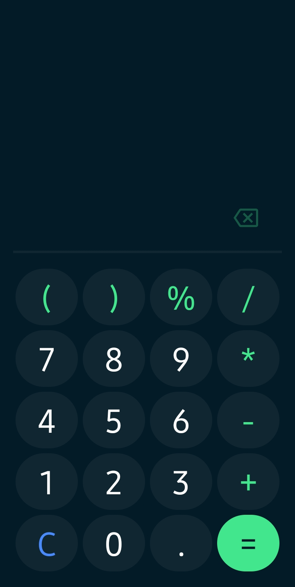
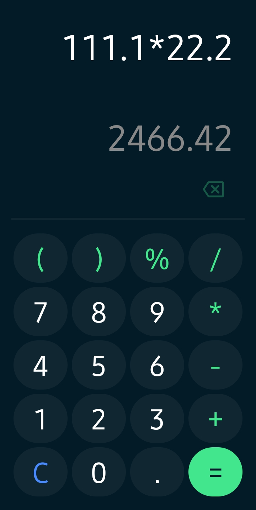

**Calculator App Using Jetpack Compose**

This Android calculator app is built using Jetpack Compose, a modern Android UI toolkit for building native user interfaces. The app provides a user-friendly interface for performing basic mathematical operations.

[Download](res/Calculator.apk) | [Source code](https://github.com/ludwigfernandes/Calculator.git)

  

**Key Concepts Covered:**

1. **Jetpack Compose**: The app leverages Jetpack Compose to create a modern and declarative user interface. Compose simplifies UI development by allowing you to define the UI components as Composable functions.

2. **State Management**: The app uses Compose's state management features, such as `remember` and `mutableStateOf`, to handle and update the input, result, and other states in the app.

3. **Custom Composables**: Custom Composables like `CalculatorButton` are defined to encapsulate the UI and behavior of calculator buttons, promoting code reuse.

4. **TextFields**: Jetpack Compose's `TextField` is used to display and edit the input and result strings. Custom styling and behavior are applied to these TextFields.

5. **User Interaction**: Users can input numbers, mathematical operators, and other symbols by tapping the calculator buttons. The app responds to user interactions and updates the display accordingly.

6. **Expression Evaluation**: The app uses the exp4j library to evaluate mathematical expressions entered by the user, including addition, subtraction, multiplication, division, and modulo operations.

7. **Decimal Formatting**: The app formats the calculated result with a decimal format to provide a clean and readable output.

8. **Backspace Functionality**: A backspace button allows users to remove the last character from the input string, making it easy to correct input errors.

9. **Theming**: The app uses theming to define the color scheme and styling, ensuring a visually appealing and consistent user interface.

10. **UI Layout**: Jetpack Compose's `Column`, `Row`, and `Box` are used to structure the UI elements, creating a responsive and user-friendly layout.

This calculator app demonstrates how to build a functional and aesthetically pleasing Android application using Jetpack Compose, emphasizing UI development, state management, and user interaction.
